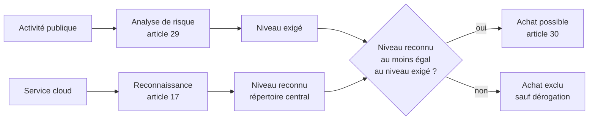

# Cloud and AI Development Act (CADA)

> [!info] En bref
> Proposition de règlement européen présentée par la Commission le **3 juin 2026**. Elle vise à tripler la capacité des data centers de l'UE en cinq à sept ans et à créer un **cadre unique à quatre niveaux** pour évaluer la souveraineté des services cloud achetés par le secteur public. Les **autorités régionales et locales sont concernées**.
> **Le texte est en négociation : rien n'est applicable aujourd'hui.** Accord politique visé fin 2027, application réaliste vers 2029.

> [!warning] Règle d'usage
> Ne jamais présenter un article, un niveau ou un délai du CADA comme une obligation en vigueur. Écrire « la proposition de la Commission prévoit ». Le texte changera pendant la négociation.

**Légende des statuts d'information**

- **[Texte]** : vérifié dans le texte de la proposition ou ses annexes.
- **[Secondaire]** : rapporté par une analyse juridique ou la presse, non vérifié dans le texte.
- **[Estimation]** : déduction de cette fiche, à confirmer.

## 1. Fiche d'identité

| Élément | Contenu |
| --- | --- |
| Nom | Cloud and AI Development Act (CADA) |
| Titre complet (traduction libre) | Règlement établissant un cadre de mesures pour renforcer l'écosystème européen du cloud et de l'IA |
| Référence | COM(2026) 502 final, 3 juin 2026 |
| Procédure | 2026/0138(COD), procédure législative ordinaire |
| Instrument | **Règlement** : directement applicable dans tous les États membres, sans transposition |
| Porteur | Commission européenne, Henna Virkkunen, DG CONNECT |
| Contexte | Paquet « souveraineté technologique » du 3 juin 2026, avec le Chips Act 2.0 et une stratégie open source |
| Statut au 19/09/2026 | Proposition en examen au Parlement européen et au Conseil |

## 2. Objet du texte

Le CADA repose sur trois volets **[Texte]** :

1. **Recherche et innovation** : « grands défis » (annexe I), initiatives de leadership cloud et IA, centres d'expérience et d'accélération pour l'IA.
2. **Capacité** : tripler la capacité des data centers en cinq à sept ans, zones d'accélération et simplification des permis. Délai visé : 12 mois dans les zones d'accélération, 18 mois ailleurs **[Secondaire]**.
3. **Autonomie** : cadre de souveraineté à quatre niveaux, règles d'achat public, principe « open source d'abord ».

## 3. Champ d'application pour le secteur public

### 3.1 Qui est concerné

- **Organismes du secteur public** au sens de l'article 2, point 1, de la directive (UE) 2019/1024 (Open Data) : l'État, les **autorités régionales ou locales**, les organismes de droit public et leurs associations **[Texte]**. Pour Bruxelles, cela vise a priori la Région, les OIP dont Paradigm, les communes et les CPAS **[Estimation]**.
- **Entités de l'Union** : institutions, organes et agences de l'UE **[Texte]**.
- **Exclusion annoncée** : les entreprises publiques du secteur des utilities (eau, énergie, transport) ne seraient pas soumises aux règles d'achat du CADA **[Secondaire]**. À vérifier pour la STIB et Vivaqua.
- **Secteur privé** : pas d'obligation directe. La Commission pourrait exiger des évaluations comparables pour les entités NIS2 (article 31) **[Secondaire]**.

### 3.2 Comprendre les quatre niveaux d'assurance (article 16 et annexe II)

#### À quoi s'appliquent les niveaux

- Un niveau qualifie **un service cloud précis** : une messagerie en ligne, un stockage, une plateforme d'hébergement, un logiciel en ligne. Il ne qualifie ni une donnée, ni une administration, ni une entreprise dans son ensemble **[Texte]**.
- Le système met en relation deux côtés **[Texte]** :
  - **Côté fournisseur :** le fournisseur fait reconnaître son service à un niveau auprès de l'autorité nationale compétente (article 17). Auto-déclaration pour le niveau 1, audit indépendant pour les niveaux 2 à 4. Les services reconnus sont inscrits dans un répertoire central.
  - **Côté administration :** l'analyse de risque (article 29) fixe le niveau exigé pour chaque activité publique. L'administration n'achète ensuite que des services reconnus au moins à ce niveau (article 30).
- Les niveaux sont **cumulatifs** : chacun reprend les exigences du précédent et en ajoute **[Texte]**.

#### Une image pour retenir

> [!example] Confier ses archives à un entrepôt
> - **Niveau 1 :** l'entrepôt est en Europe et la société qui le gère a une adresse en Europe.
> - **Niveau 2 :** un auditeur vérifie que personne à l'étranger ne peut ouvrir les portes à distance ni fermer l'entrepôt.
> - **Niveau 3 :** la société appartient à des Européens et les gardiens sont européens.
> - **Niveau 4 :** même les serrures et l'alarme sont conçues et maîtrisées en Europe.

#### Tableau des niveaux

| Niveau, question et exigences **[Texte]** | Vérification, part des marchés et exemples dans les autres administrations | Services d'Atlas probablement concernés **[Estimation]** |
| --- | --- | --- |
| **1. Localisation** *Plancher pour tout achat de cloud public*  **Question :** où sont les données ?  **Exigences :** fournisseur établi dans l'UE ; serveurs et données, **y compris métadonnées et télémétrie**, dans l'UE, sauf demande explicite de l'organisme ; sous-traitants connus et contrôlés ; support hors UE permis mais encadré ; si le fournisseur est contrôlé depuis un pays tiers, aucune loi de ce pays ne l'oblige à signaler les failles à ses autorités avant leur exploitation | **Vérification :** auto-déclaration **Part des marchés :** environ 70 %  **Exemples :** • sites d'information et de promotion (be.brussels, visit.brussels) • agendas et inscriptions à des événements • bureautique, messagerie et visioconférence en ligne (type Microsoft 365) des administrations sans mission d'ordre public • gestion des subsides et appels à projets (hub.brussels, Innoviris) • intranets et e-learning | **RH du SPRB :** gestion du personnel, formation **talent.brussels :** recrutement, sélection, tests en ligne **Finances et Budget :** budget, comptabilité (SAP) **equal.brussels :** subsides, campagnes, appels à projets **easy.brussels :** simplification des démarches, formulaires **ConnectIT :** helpdesk, archives (ConnectMemory), démarches en ligne (Salesforce) **Facilities :** bâtiments, logistique, réservations **IBSA :** statistiques publiques, open data **Paradigm :** sites web régionaux, UrbIS, outils de gestion **Tous :** bureautique, messagerie, visioconférence en ligne |
| **1 ou 2 : zone grise** *Données sensibles sans lien clair avec l'ordre public*  **Exigences :** celles du niveau 1 ou du niveau 2, selon le résultat de l'analyse de risque belge (voir « Zone grise et points d'attention » ci-dessous) | **Vérification :** selon le niveau retenu  **Exemples :** • aides et allocations (Iriscare) • emploi (Actiris) • permis d'urbanisme (urban.brussels) | **Bruxelles Fiscalité :** impôts régionaux dont le précompte immobilier, plateforme MyTax, contentieux **RH et paie :** dossiers du personnel **IBSA :** microdonnées statistiques confidentielles **Finances et Budget :** paiements et trésorerie **Paradigm :** guichet IRISbox, gestion des identités et des accès des agents |
| **2. Indépendance vérifiée** *Activités liées à l'ordre public*  **Question :** un État étranger peut-il accéder aux données ou couper le service ?  **Exigences :** niveau 1, plus : sous-traitants, actifs et personnel dans l'UE ; support exclusivement dans l'UE ; aucune fonction permettant de modifier ou de couper le service à distance ; inventaire des composants logiciels (SBOM) ; certification cyber « substantiel » ; données non utilisées pour entraîner une IA étrangère ; maison mère étrangère possible si des mesures l'empêchent de brider ou d'interrompre le service ; nationalité européenne du personnel si l'administration l'exige | **Vérification :** audit indépendant **Part des marchés :** environ 20 %  **Exemples :** • gestion du trafic, des feux et des tunnels (Bruxelles Mobilité) • supervision de l'eau et de l'assainissement (Vivaqua, SBGE)\* • collecte et traitement des déchets (Bruxelles-Propreté) • systèmes des hôpitaux publics • exploitation du Port de Bruxelles\* | **Paradigm et ConnectIT**, pour la part de leurs services partagés qui sert des activités de niveau 2 d'autres entités : • hébergement au datacenter régional des applications de Bruxelles Mobilité • sauvegardes, supervision de sécurité, intégration de services • plateformes centrales (identité, ERP, Salesforce) si elles portent des démarches liées à l'ordre public |
| **3. Contrôle européen** *Sensibilité élevée*  **Question :** qui contrôle l'entreprise et qui y travaille ?  **Exigences :** niveau 2, plus : aucun contrôle par un pays tiers ou une entreprise étrangère, sauf pays « associés » reconnus par la Commission (article 18) ; personnel citoyen européen ; support par des résidents de l'UE ; audit du code source des composants étrangers ; plans de migration en cas de défaillance ; données jamais transférées hors UE | **Vérification :** audit indépendant **Part des marchés :** moins de 10 %  **Exemples :** • gestion de crise et plans d'urgence régionaux (safe.brussels) • partage régional des images de vidéoprotection • gestion des interventions des pompiers et de l'aide médicale urgente (SIAMU) • plans et données de sécurité des infrastructures critiques (tunnels, réseaux) | **Paradigm**, uniquement pour les environnements qui hébergent ces activités. Plutôt que de relever tout le datacenter au niveau 3, on peut séparer les environnements selon leur niveau. |
| **4. Maîtrise technologique** *Fonctions les plus critiques*  **Question :** maîtrise-t-on la technologie elle-même ?  **Exigences :** niveau 3, plus : aucun contrôle étranger, sans exception ; **maîtrise effective des composants logiciels** (aucun acteur étranger n'influence leur conception, leur maintenance ou leur évolution) ; certification cyber « élevé » | **Vérification :** audit indépendant **Part des marchés :** environ 1 %  **Exemples :** défense, renseignement, informations classifiées (compétences fédérales). **Peu ou pas de services régionaux attendus.** | **Aucun service d'Atlas attendu** |

\* À vérifier : la proposition exclurait des règles d'achat du CADA les entreprises publiques des secteurs dits « utilities » (eau, énergie, transport) **[Secondaire]**.

- **Parts des marchés :** estimations de la Commission rapportées par le Financial Times **[Secondaire]**.
- **Exemples :** illustrations de cette fiche, pas un classement officiel. Le classement réel viendra de l'analyse de risque belge (article 29).
- **Atlas :** selon la DPR 2026-2029 (section 4.1), Bruxelles-Transversalité regroupe dix entités : le service RH du SPRB, talent.brussels, Finances et Budget, ConnectIT, Paradigm, equal.brussels, easy.brussels, la Régie foncière du SPRB (Facilities), l'IBSA et Bruxelles Fiscalité **[Texte DPR]**. Ce sont surtout des fonctions de support.

> [!tip] Lecture pour Atlas **[Estimation]**
> - **La majorité des services d'Atlas devrait relever du niveau 1**, mais ce niveau pèse plus qu'il n'y paraît : fournisseur établi dans l'UE, données, métadonnées et télémétrie dans l'UE. Les grandes plateformes logicielles d'Atlas (Salesforce, SAP, suites bureautiques en ligne) sont concernées. Leur conformité est à vérifier auprès des fournisseurs, sans présumer de la réponse.
> - **L'enjeu principal se trouve dans les services partagés.** Paradigm et ConnectIT hébergent ou opèrent des services pour d'autres piliers, dont certains relèvent du niveau 2 ou 3. Une plateforme commune doit alors offrir le niveau le plus élevé pour ces activités, ou être séparée en environnements distincts (voir « Plateformes mutualisées » ci-dessous). C'est un choix d'architecture à intégrer au TOM IT d'Atlas.
> - **Deux inconnues peuvent faire monter Atlas d'un cran :** la désignation éventuelle d'Atlas par le CCB comme entité NIS2 du secteur « administration publique », combinée à une lecture large de l'article 29 ; le classement des données fiscales et personnelles.
> - **Probablement hors du champ du CADA** (à faire vérifier par un juriste) : IrisNet, qui est un réseau et non un service cloud ; les services que Paradigm fournit en interne aux autres entités régionales, s'ils ne passent pas par un marché public.

> [!quote]- Texte original des critères du niveau 1 (annexe II, point 1.1)
> (a) the cloud computing service provider is established in the Union;
> (b) the infrastructure and assets of the cloud computing service provider, including those of its subcontractors which are involved in the provision of the service, are located in the Union unless the public sector body explicitly requires otherwise;
> (c) the customer data, including metadata and telemetry data, that is processed, stored and transferred by the cloud computing service provider, and by the subcontractors, which are involved in the provision of the service, remain exclusively within the Union, unless the public sector body explicitly requires otherwise and at any time, including before, during or after the configuration or use of the service;
> (d) where the cloud computing service provider outsources the technical and operational support or assistance, including any subsequent sub-outsourcing arrangements, to third-party service providers outside of the Union, the necessary legal, technical and organisational measures are implemented to ensure traceability, security and governance of those operations and those operations do not, in any way, compromise the operational autonomy of the cloud computing service provider;
> (e) the cloud computing service provider demonstrates that the service complies with the state-of-the-art cybersecurity standards;
> (f) the cloud computing service provider provides full transparency around the use of subcontractors. The cloud computing service provider subjects subcontractors to due diligence, contractual obligations and ongoing oversight to meet Union legal obligations;
> (g) Where the cloud computing service provider is subject to the control of a third country or a legal entity established in a third-country, the cloud computing service provider guarantees that there are no existing laws and practices in that third country, demonstrated by independent sources, that require the cloud computing service provider to report information on software vulnerabilities to authorities of that third country prior to those vulnerabilities being known to have been exploited.

#### Qui pourrait prétendre à quel niveau ?

> [!note] Profils de fournisseurs **[Estimation]**
> Aucune reconnaissance n'existe encore : ces profils illustrent la logique des niveaux, ils ne préjugent pas du résultat.
> - **Niveau 1 :** la filiale européenne d'un fournisseur américain qui héberge tout en Europe, télémétrie comprise. **Limite :** ce niveau ne protège pas contre le CLOUD Act, puisque la maison mère reste soumise au droit de son pays.
> - **Niveau 2 :** les offres « cloud souverain » créées en Europe par les grands fournisseurs américains (filiale séparée, personnel européen) visent ce niveau. Leur qualification est au cœur du débat.
> - **Niveau 3 :** des fournisseurs sous contrôle européen, sous réserve d'audit. Un opérateur européen qui exploite une technologie américaine sous licence (comme Bleu ou S3NS en France) pourrait aussi viser ce niveau : c'est le contrôle de l'entreprise qui compte ici, pas l'origine du logiciel.
> - **Niveau 4 :** un cloud gouvernemental européen bâti sur des logiciels maîtrisés, par exemple de l'open source entretenu en interne ou un éditeur européen.

#### Le cas bruxellois : posséder n'est pas maîtriser

> [!tip] Illustration pour le chantier **[Estimation]**
> Le datacenter régional est exploité par Paradigm, organisme public européen : il remplit l'exigence de contrôle du niveau 3. Mais tant qu'il repose sur VMware (cas de dépendance étudié dans le rapport intermédiaire), dont Broadcom, entreprise américaine, décide seule des évolutions et des prix, il ne pourrait pas prétendre au niveau 4, qui exige la maîtrise effective des composants logiciels.
> Le passage du niveau 3 au niveau 4 illustre l'idée du rapport : **posséder n'est pas maîtriser** (voir [[Rapport intermédiaire V7 - septembre 2026 (Synthèse critique)]]).

#### Zone grise et points d'attention

- **Données sensibles sans lien clair avec l'ordre public** (ligne « 1 ou 2 » du tableau) : fiscalité régionale, aides et allocations, emploi, urbanisme, authentification des citoyens, dossiers du personnel, microdonnées statistiques. Dans la proposition, c'est le lien avec l'ordre public qui déclenche les niveaux 2 à 4, pas la seule sensibilité des données. L'analyse de risque doit toutefois tenir compte des risques pour les données personnelles. Ces services pourraient donc relever du niveau 1 ou du niveau 2 selon l'analyse belge **[Estimation]**.
- **Lecture de NIS2 :** l'« administration publique » est elle-même un secteur de la directive NIS2. Une lecture large pourrait faire monter beaucoup plus de services régionaux au niveau 2 **[Estimation]**.
- **Plateformes mutualisées :** une infrastructure partagée, comme le datacenter régional, qui héberge une activité de niveau 3 devra offrir le niveau 3 pour cette activité. Deux options : relever le niveau de toute la plateforme ou séparer les environnements selon leur niveau **[Estimation]**.

#### Ne pas confondre avec les niveaux SEAL

Les niveaux du CADA (1 à 4) ne sont pas les niveaux SEAL-0 à SEAL-4 du [[Cadre de souveraineté cloud de la Commission]] (octobre 2025), cité dans la V7.

- **SEAL :** outil de notation conçu pour les achats de la Commission, sans valeur d'obligation pour la Région.
- **CADA :** règle de droit proposée, qui s'appliquerait à tous les organismes publics.

Une correspondance entre les deux échelles reste à établir (piste 4 de la section 7).

### 3.3 Analyse de risque (article 29)

**[Texte]**

- **Qui :** les États membres et les entités de l'Union.
- **Quand :** au plus tard un an après l'entrée en vigueur, puis au moins tous les deux ans.
- **Quoi :** identifier les activités publiques qui utilisent le cloud et contribuent à l'ordre public (secteurs critiques NIS2, sécurité nationale, défense, justice, forces de l'ordre), puis fixer pour chacune le niveau 2, 3 ou 4.
- **Critères :** sensibilité et criticité des données, risques pour les données personnelles et l'ordre public, risque d'accès par un pays tiers, risque d'interruption du service.
- **Rôle de la Commission :** elle peut imposer une méthode par acte d'exécution et fixer elle-même le niveau si une évaluation est jugée insuffisante.

### 3.4 Achats publics (articles 30 à 33, 41)

- **Article 30 [Texte] :** le niveau 1 est le minimum pour tout achat de cloud ; les niveaux 2 à 4 s'imposent aux activités identifiées par l'analyse de risque. **Dérogations exceptionnelles** si aucun service reconnu n'existe dans le répertoire central, si une procédure précédente n'a donné que des offres inadaptées ou si le coût est disproportionné. Le texte ne définit pas le coût disproportionné **[Secondaire]**.
- **Article 17 [Texte] :** le fournisseur demande sa reconnaissance à l'autorité nationale compétente de son État d'établissement. Les services reconnus sont inscrits dans un répertoire central.
- **Article 32 [Texte] :** critères d'attribution de « valeur ajoutée de l'Union » obligatoires pour le cloud et l'IA. Ils ne peuvent pas être décisifs ; pondération évoquée jusqu'à 15 points sur 120 **[Secondaire]**.
- **Article 33 :** objectif de 25 % des achats cloud et IA auprès de PME innovantes, avec un rapport annuel **[Secondaire]**.
- **Achats communs :** la Commission pourrait acheter pour le compte des États membres et de leurs autorités **[Secondaire]**.
- **Article 41 :** principe « open source d'abord » et catalogue européen de solutions open source, visant d'abord les entités de l'Union **[Texte]**.
- **Contrats en cours :** aucune disposition transitoire trouvée dans les sources consultées. Une analyse mentionne un délai de 12 mois pour migrer lorsqu'une analyse de risque impose de changer de fournisseur **[Secondaire, à vérifier dans le texte]**.

### 3.5 Obligations des États membres

- Adopter une **stratégie nationale cloud et IA** dans l'année suivant l'entrée en vigueur, couvrant les niveaux national, régional et local (article 7) **[Texte]**.
- Désigner au moins une **zone d'accélération pour les data centers** dans les six mois **[Secondaire]**.
- Désigner une autorité nationale compétente pour la reconnaissance des fournisseurs **[Texte]**.

## 4. État de la procédure au 19 septembre 2026

| Date | Étape | Statut |
| --- | --- | --- |
| Avril 2026 | Feuille de route commune des institutions : accord visé d'ici fin 2027 | [Secondaire] |
| 3 juin 2026 | Proposition COM(2026) 502 | [Texte] |
| 7 juillet 2026 | Reinier van Lanschot (Verts/ALE, Volt, Pays-Bas) nommé rapporteur pour la commission IMCO | [Secondaire] |
| Juillet 2026 | Diego Solier (ECR, Espagne) nommé rapporteur principal. Orientation : dérégulation, nucléaire pour les data centers | [Secondaire] |
| 8 septembre 2026 | Examen au groupe de travail Télécommunications du Conseil, présidence irlandaise | [Secondaire] |
| 18 septembre 2026 | Clôture de la consultation nationale irlandaise | [Secondaire] |
| 23 et 24 septembre 2026 | Avis du CESE prévu en plénière (rapporteur Miroslav Hajnoš) | [Secondaire] |

Pas encore de projet de rapport au Parlement. Les rapporteurs fictifs ne sont pas tous nommés. La répartition des compétences entre commissions parlementaires est à confirmer sur l'OEIL.

## 5. Calendrier prévisionnel

| Étape | Échéance | Statut |
| --- | --- | --- |
| Position du Parlement | Juin ou juillet 2027 | Objectif du rapporteur [Secondaire] |
| Présidences du Conseil | Lituanie (1er semestre 2027), Grèce (2e semestre 2027) | Calendrier des présidences |
| Accord politique en trilogue | Fin 2027 | Objectif politique [Secondaire] |
| Publication au Journal officiel | 2028 | [Estimation] |
| Entrée en vigueur | Publication + 20 jours | [Texte] article 48 |
| Zones d'accélération désignées | Entrée en vigueur + 6 mois | [Secondaire] |
| **Application du règlement, stratégies nationales, premières analyses de risque** | **Entrée en vigueur + 1 an, soit vers 2029** | [Texte] article 48 + [Estimation] |
| Analyses de risque suivantes | Au moins tous les deux ans | [Texte] |
| Évaluation du règlement par la Commission | Entrée en vigueur + 5 ans | [Texte] |

Le cabinet Arthur Cox estime qu'une adoption « pas avant 2027 ou 2028, voire plus tard » est réaliste.

## 6. Points de débat

- **Ouverture aux fournisseurs non européens** : reconnaissance au niveau 3 de fournisseurs de pays tiers « associés » (article 18). Conditions évoquées : décision d'adéquation, pas d'accès contraint aux données non personnelles, pas d'interruption de service imposée par des sanctions **[Secondaire]**.
- **Dérogations** : le critère de coût disproportionné reste flou.
- **Critique de discrimination** portée par les associations de fournisseurs américains et internationaux (CCIA).
- **Ambition** : des acteurs européens comme Nextcloud demandent d'étendre le texte au secteur privé ; d'autres élus insistent sur l'ouverture aux investissements étrangers.
- **Subsidiarité** : place des stratégies nationales et des analyses de risque par État.
- **Orientations politiques divergentes** entre le rapporteur principal (ECR) et les socialistes (S&D) **[Secondaire]**.

## 7. Ce que cela implique pour la Région bruxelloise

> [!tip] Pistes proposées (à discuter en GT, pas des décisions)
> 1. **Contrats :** un contrat cloud ou SaaS pluriannuel signé aujourd'hui sera encore en cours en 2029. Vérifier la compatibilité avec le niveau 1 (télémétrie et métadonnées dans l'UE, support hors UE encadré) et prévoir une clause de révision.
> 2. **Classification des activités :** commencer à repérer les activités régionales liées à l'ordre public. C'est le même travail que la cartographie des dépendances du chantier : utile quel que soit le texte final.
> 3. **Gouvernance belge :** clarifier qui fera l'analyse de risque en Belgique et faire valoir la position régionale dans la coordination belge qui prépare les positions au Conseil.
> 4. **Grille du GT6 :** établir une correspondance entre les quatre niveaux du CADA et le cadre de souveraineté cloud de la Commission (SEAL-0 à SEAL-4). Les deux classifications diffèrent.
> 5. **Analyses de marché :** documenter dès maintenant l'offre disponible. Les dérogations futures reposeront sur la preuve d'une absence d'alternative ou d'un coût disproportionné.
> 6. **Cahiers des charges :** tester des critères de valeur ajoutée européenne, de réversibilité et d'open source, en s'appuyant sur le [[Data Act]] déjà applicable.
> 7. **Stratégie nationale et data centers :** préparer la contribution bruxelloise à la future stratégie nationale et à la question des zones d'accélération (foncier, énergie).

> [!question] Questions ouvertes et angles morts
> - En Belgique, qui réalisera l'analyse de risque de l'article 29 : le fédéral pour tous, ou chaque entité fédérée pour son périmètre ?
> - Les services cloud que Paradigm fournit aux administrations régionales relèvent-ils de l'article 30 ? Une coopération « in house » échappe probablement aux règles d'achat, mais c'est à faire vérifier par un juriste. Paradigm devrait-il faire reconnaître ses services à un niveau ?
> - Opportunité : un service régional mutualisé reconnu au niveau 2 ou plus pourrait-il servir les activités sensibles de la Région ? À évaluer, sans présumer de la réponse.
> - Les services SaaS actuels (bureautique, collaboration) satisfont-ils les critères du niveau 1, en particulier pour la télémétrie et le support hors UE ? À demander aux fournisseurs.
> - Quelles activités régionales relèvent de l'ordre public (sécurité et prévention, secours, mobilité, santé, eau), et lesquelles sont exclues au titre des utilities ?
> - Les services à données sensibles sans lien clair avec l'ordre public (fiscalité, aides sociales, emploi) relèveront-ils du niveau 1 ou du niveau 2 ? Voir la zone grise en 3.2.
> - Atlas, ou certaines de ses entités, sera-t-il désigné par le CCB comme entité NIS2 du secteur « administration publique » ? Cela pourrait élargir le périmètre de l'analyse de risque.
> - Comment articuler les niveaux du CADA avec les labels existants (EUCS, SecNumCloud) ?

## 8. Articulation avec les autres cadres

| Cadre | Statut | Rôle pour la Région |
| --- | --- | --- |
| [[Data Act]] | Applicable depuis le 12 septembre 2025 pour le changement de fournisseur cloud ; frais de changement supprimés à partir du 12 janvier 2027 | Levier contractuel immédiat : réversibilité, portabilité |
| [[NIS2]] | Applicable (loi belge du 26 avril 2024) | Gestion des risques de la chaîne d'approvisionnement ; les secteurs NIS2 servent de repère à l'article 29 du CADA |
| [[Cadre de souveraineté cloud de la Commission]] | Outil d'achat publié en octobre 2025 (SEAL-0 à SEAL-4) | Référentiel prêt à l'emploi pour la grille du GT6. Échelle différente des niveaux du CADA (voir 3.2) |
| CADA | Proposé | Direction du futur droit ; plancher niveau 1 pour tout achat de cloud public |

## 9. À surveiller

- [ ] Avis du CESE (23 et 24 septembre 2026)
- [ ] Rapport d'avancement de la présidence irlandaise, probablement au Conseil Télécom de décembre 2026 **[Estimation]**
- [ ] Projet de rapport du Parlement (rapporteur Diego Solier)
- [ ] Position belge au Conseil et association des Régions
- [ ] Évolution des niveaux 1 et 3 et de l'article 18 pendant la négociation

## 10. Fiches liées

- [[Rapport intermédiaire V7 - septembre 2026 (Synthèse critique)]] : section 1.4, cadre européen et belge.
- [[Note d’avis — Move2Cloud - CADA|Note d'avis Move2Cloud CADA]] : analyse interne à confronter à cette fiche ; ses obligations et délais ne sont pas en vigueur.
- [[Souveraineté Numérique]]
- [[Contexte du projet]]
- [[Objectifs et organisation du chantier 12]]
- [[Déclaration de Politique Régionale du Gouvernement bruxellois - février 2026]]
- [[Benchmark des initiatives et solutions de souveraineté numérique]]
- Fiches à créer si elles n'existent pas : [[Data Act]], [[NIS2]], [[Cadre de souveraineté cloud de la Commission]].

## 11. Sources

Consultées le 19 septembre 2026.

**Sources officielles**

- Commission européenne, [page de politique CADA](https://digital-strategy.ec.europa.eu/en/policies/cloud-and-ai-development-act) et [proposition, annexes et analyse d'impact](https://digital-strategy.ec.europa.eu/en/library/proposal-cloud-and-ai-development-act-cada)
- EUR-Lex, [COM(2026) 502 final](https://eur-lex.europa.eu/legal-content/EN/TXT/?uri=COM%3A2026%3A502%3AFIN) et [annexes](https://eur-lex.europa.eu/resource.html?uri=cellar%3A6e73e2db-5f40-11f1-aa6d-01aa75ed71a1.0001.02%2FDOC_2&format=PDF)
- Articles consultés via Better Regulation : [article 2](https://service.betterregulation.com/document/850489), [article 29](https://service.betterregulation.com/document/850532), [article 30](https://service.betterregulation.com/document/850533), [article 48](https://service.betterregulation.com/document/850557)
- Commission, [communiqué du 3 juin 2026](https://ec.europa.eu/commission/presscorner/api/files/document/print/en/ip_26_1187/IP_26_1187_EN.pdf)
- Parlement européen, [OEIL, procédure 2026/0138(COD)](https://oeil.europarl.europa.eu/oeil/en/procedure-file?reference=2026/0138(COD))
- Conseil, [groupe Télécommunications du 8 septembre 2026](https://www.consilium.europa.eu/en/meetings/mpo/2026/9/wp-on-telecommunications-and-information-society-(369579)/)
- CESE, [avis sur le CADA](https://www.eesc.europa.eu/en/our-work/opinions-information-reports/opinions/cloud-and-ai-development-act)
- Irlande, [consultation publique sur le CADA](https://enterprise.gov.ie/en/consultations/public-consultation-cada.html)

**Sources régionales et belges**

- [Déclaration de politique régionale 2026-2029](https://www.mr.be/wp-content/uploads/2026/02/FDPR-Bruxelles.pdf), section 4.1 (entités de Bruxelles-Transversalité)
- be.brussels, [Bruxelles ConnectIT](https://be.brussels/en/about-region/structure-and-organisations/overview-administrations-and-institutions-region/brussels-connectit) (Salesforce, SAP, ConnectMemory, easy.brussels)
- [MyTax](https://fisc.brussels/mytax/fr/), plateforme de Bruxelles Fiscalité
- UVCW, [NIS2 et pouvoirs locaux](https://www.uvcw.be/e-gov/actus/art-9012) ; CCB, [la loi NIS2](https://ccb.belgium.be/fr/nis2)

**Analyses juridiques**

- [Eubelius](https://www.eubelius.com/en/news/the-cloud-and-ai-development-act-cada-public-procurement-sets-the-tone-as-a-strategic-tool-to) (cabinet belge, marchés publics)
- [Arthur Cox](https://www.arthurcox.com/knowledge/eu-tech-sovereignty-package-implications/)
- [Wilson Sonsini](https://www.wsgr.com/en/insights/european-commission-publishes-proposal-for-act-to-reduce-reliance-on-foreign-cloud-and-ai.html)
- [Lawfare](https://www.lawfaremedia.org/article/the-eu-cloud-and-ai-development-act)
- [Freshfields](https://www.freshfields.com/en/our-thinking/blogs/technology-quotient/shifting-away-from-dependency-the-eus-tech-sovereignty-package-102n7kn)
- [Future of Privacy Forum](https://fpf.org/blog/cada-an-eu-turn-on-ai-regulation/)
- [Knowledge Centre Data & Society](https://data-en-maatschappij.ai/en/publications/de-recent-voorgestelde-cloud-and-ai-development-act-wat-u-moet-weten)
- [Kieltyka Gladkowski](https://www.kg-legal.eu/info/it-new-technologies-media-and-communication-technology-law/note-eu-cloud-and-ai-development-act-cada-projectand-the-concept-of-the-sovereign-cloud-in-the-european-unions-digital-policy/)

**Presse**

- Agence Europe : [van Lanschot rapporteur IMCO](https://agenceurope.eu/en/bulletin/article/13904/30/reinier-van-lanschot-appointed-rapporteur-on-cloud-and-ai-development-act-within-european-parliaments-imco-committee), [Solier rapporteur principal](https://agenceurope.eu/en/bulletin/article/13913/22/european-parliament-appoints-spaniard-diego-solier-lead-rapporteur-on-regulation-on-development-of-cloud-and-ai)
- [elDiario.es, 4 septembre 2026](https://www.eldiario.es/tecnologia/diputado-rebotado-grupo-alvise-sera-voz-clave-proxima-gran-ley-ia-europea_1_13484944.html)
- [Euronews, 22 juin 2026](https://www.euronews.com/next/2026/06/22/eus-cloud-and-ai-development-act-gets-mixed-reception)
- [eu-cloud-ai-act.com](https://eu-cloud-ai-act.com/) (site de veille, feuille de route commune)

## Historique de la fiche

- **2026-09-19** : création. Veille sur l'état du CADA, rédigée avec l'aide d'une IA. À valider par le GT avant de passer de l'Inbox à `03 - Connaissances`.
- **2026-09-19** : section 3.2 enrichie pour expliquer les niveaux : principe et schéma, image de l'entrepôt, tableau avec exemples bruxellois, profils de fournisseurs, cas du datacenter régional, zone grise, distinction avec SEAL. Critères des niveaux 2 et 3 précisés d'après l'annexe II.
- **2026-09-19** : tableau des niveaux fusionné avec les services des dix entités d'Atlas (colonne dédiée, ligne « zone grise »), encadré « Lecture pour Atlas », question sur NIS2 ajoutée en section 7, sources régionales ajoutées.
